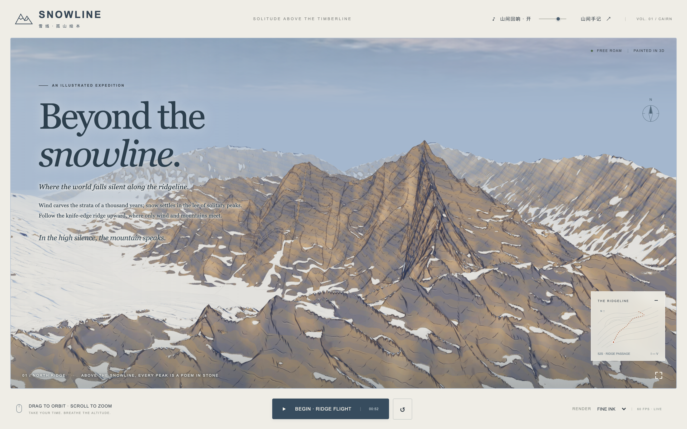

# bande-dessinee-3d-scene

> **French Bande Dessinée (*Ligne Claire* / Mathieu Bablet *Cairn*) 3D Web Scene Skill** for **Codex** & **Google Antigravity**



An end-to-end agent skill that turns **a single text prompt** (plus **optional reference video/images**) into a production-grade, interactive 3D web experience in the style of French graphic novels (*Bande Dessinée* / *Cairn* by The Game Bakers & Mathieu Bablet).

---

## Features & Visual Standard

1. **Procedural Chiseled Blender Terrain (`scripts/build_world.py`)**
   - Tectonic domain warping, folded angular rock buttresses, and stepped horizontal geological strata (no smooth heightmap cones or pyramid crease artifacts).
   - Seamless `5×5` multi-tile LOD grid with `2048×2048` tangent-space normal maps and 3-tone mineral rock pigments (`#535E73` slate, `#716C6D` umber, `#968678` warm ochre).
   - Automated `Meshopt` + `WebP` GLB compression (`@gltf-transform/cli`) and `gltf-validator` verification.

2. **Real-Time Bande Dessinée GLSL Shader (`src/scene.js`)**
   - High-contrast 3-band graphic novel cel shading (warm sandstone-ochre sunlit faces vs deep Prussian-indigo shadows).
   - Razor-sharp snow-vs-rock color blocks with `1px` screen-space adaptive ink outlines (`fwidth`).
   - Built-in anti-artifact rules: per-pixel normal-mapped crease ink (zero triangle-grid "caterpillar" teeth), smooth-stepped rock facet perturbation (zero `floor()` pixel speckles), mutually exclusive strata vs dihedral ink regions (zero `X`/`+` crosses), and `MirroredRepeatWrapping` seamless sky dome.

3. **Zero-Stutter Drone Flight & Procedural WebAudio (`src/camera-controller.js`, `src/audio.js`)**
   - Dual `CatmullRomCurve3` splines (`posCurve` + `lookCurve`) with arc-length resampling and framerate-independent quaternion slerp damping.
   - 100% local WebAudio synthesizer: altitude-reactive pink-noise alpine wind, warm harmonic drone pads, and sparse crystalline mountain notes with a real-time volume slider.
   - Editorial typography pairing a Chinese masthead (`雪 线 · 孤 山 绘 本`) and authentic mountain literature quotes (Nan Shepherd, Robert Macfarlane, John Muir) with poetic English HUD chapters.

---

## One-Line Installation (Codex & Antigravity)

Clone this repository and run `./install.sh`:

```bash
git clone git@github.com:BitterSweetC/bande-dessinee-3d-scene.git
cd bande-dessinee-3d-scene
./install.sh
```

Or install directly into your skill directories:
- **Codex**: `~/.codex/skills/bande-dessinee-3d-scene`
- **Antigravity (Global)**: `~/.gemini/config/skills/bande-dessinee-3d-scene`
- **Antigravity (Workspace)**: `<your-repo>/.agents/skills/bande-dessinee-3d-scene`

---

## Usage

### In Codex
```text
$bande-dessinee-3d-scene 帮我在当前目录制作一个法式绘本（Cairn 风格）的雪山/峡湾 3D 场景，支持丝滑无人机巡航和山风空灵背景乐（可选参考视频：./reference.mp4）
```

### In Antigravity
```text
使用 bande-dessinee-3d-scene 技能，根据这段描述（或参考视频）从零制作一个法式绘本风格的 3D 场景：……
```

---

## Repository Structure

```text
bande-dessinee-3d-scene/
├── SKILL.md                                 # Master 6-stage workflow instructions
├── README.md                                # Documentation & preview
├── install.sh                               # One-click installer for Codex & Antigravity
├── agents/
│   └── openai.yaml                          # Codex skill UI metadata
├── references/
│   ├── blender-geology-pipeline.md          # Blender chiseled terrain & GLB optimization guide
│   ├── cairn-shader-and-sky.md              # Custom GLSL shader & 5 mandatory anti-artifact rules
│   └── smooth-flight-and-audio.md           # Dual-spline camera, WebAudio synth & literary UI guide
├── scripts/
│   └── scaffold_bande_dessinee_scene.py     # Scaffolds the golden template into any target directory
└── assets/
    └── snowline-template/                   # Complete working Blender + Three.js + WebAudio template
```
